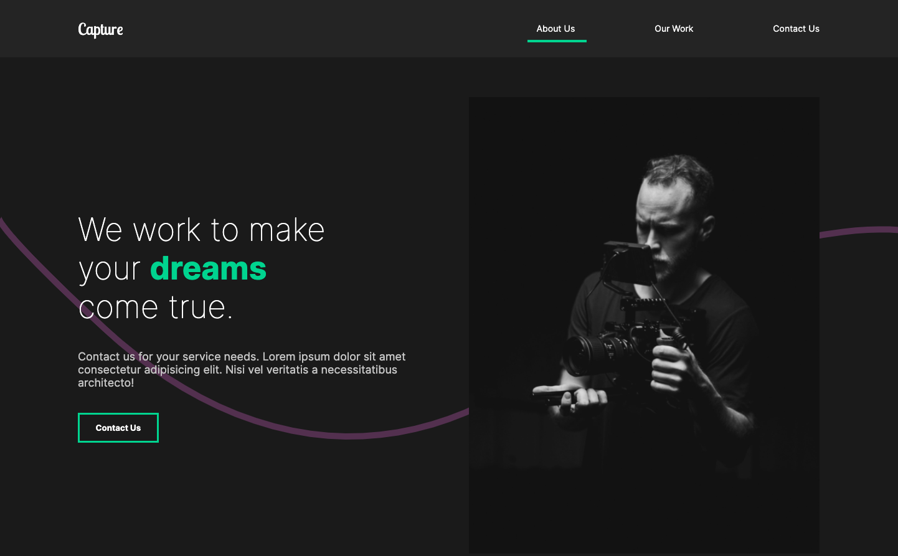
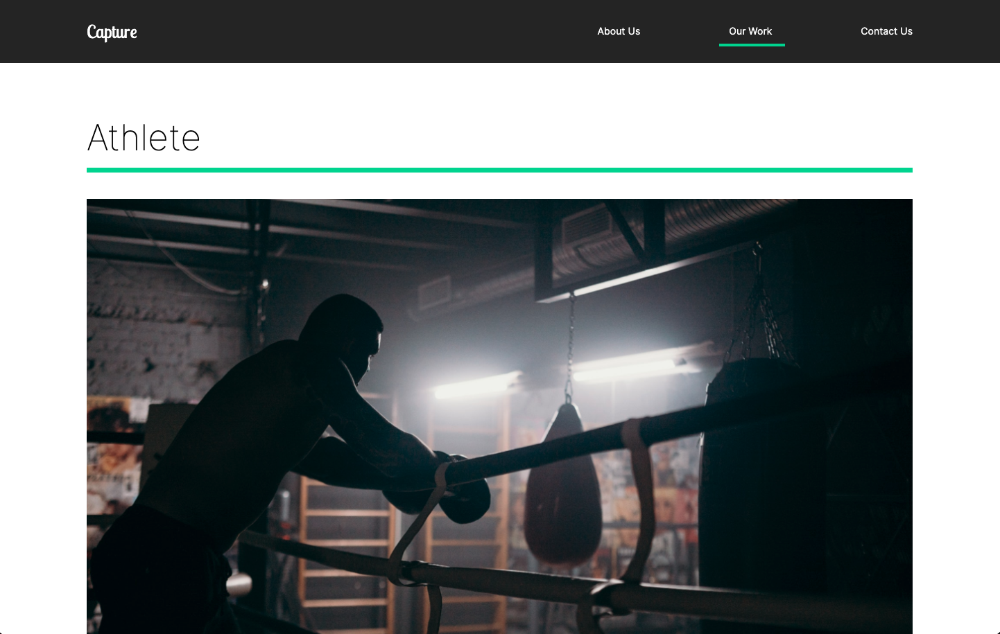
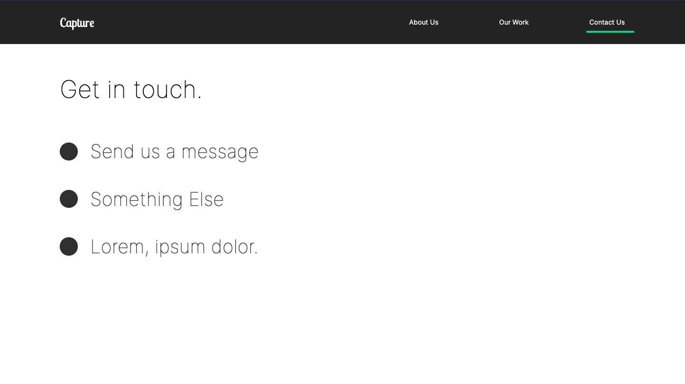
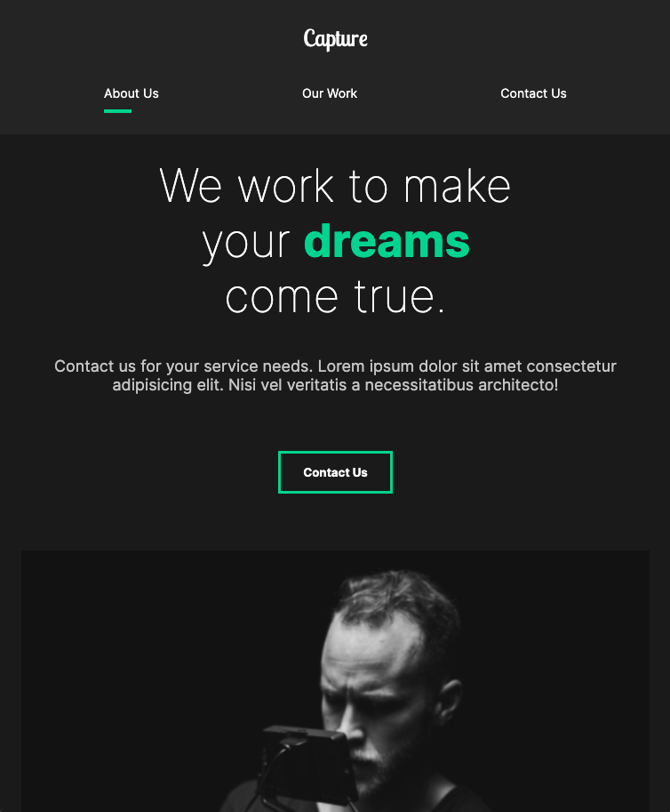
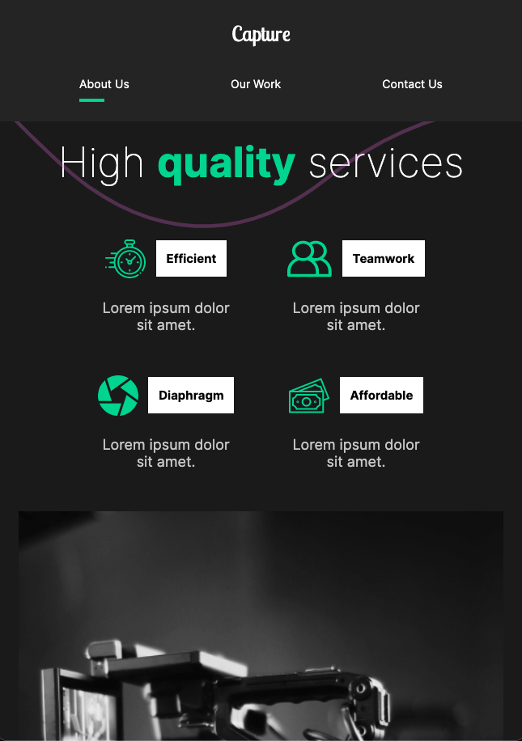
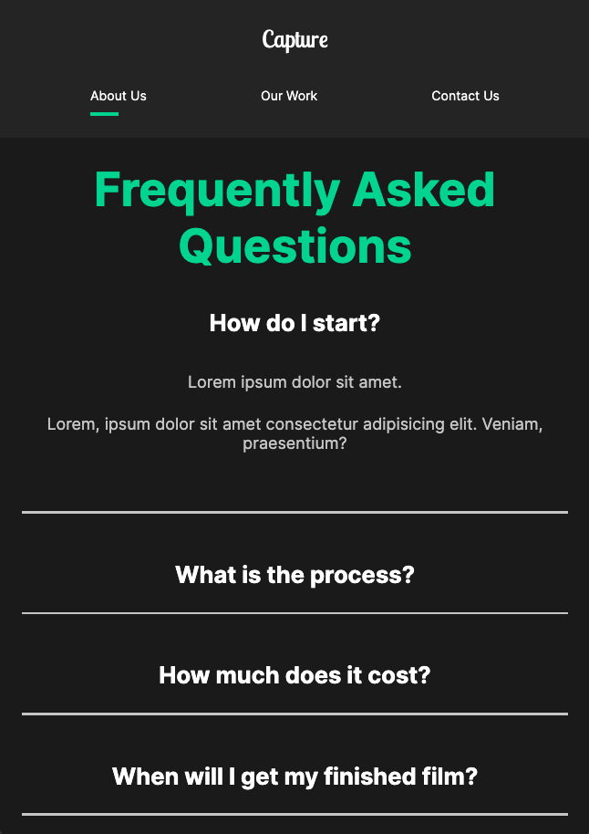

# "Capture" Animated Portfolio

[Click here to launch.](https://judeclark19.github.io/capture/)

This portfolio website was built as an exercise in [@developedbyed](https://github.com/developedbyed)'s React course. The primary feature of this project is that it uses [Framer Motion](https://www.framer.com/motion/) to give the user an engaging, unique, and high-quality experience when they visit the site.

## Desktop Screenshots

## Mobile Screenshots

